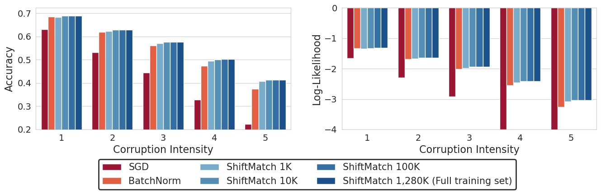

# ShiftMatchImageNet

This repo contains ShiftMatch experiments on ImageNet for reproducing the results in Fig.5 of https://openreview.net/pdf?id=kUI41mY8bHl

Experiments are based on the ResNet implementation and checkpoint provided by https://github.com/abarcel/haikumodels. The implementation of ShiftMatch is located in `./haikumodels/applications/shift_match.py`. The statistics required for ShiftMatch transform are stored in `./cov_cache`.

## Requirements
`tensorflow-datasets`

`haiku-dm`

`jax`

## How to run
The plain "SGD" baseline results can be acquired by calling 

```python eval_imagenet_c_baseline.py```

The "BatchNorm" baseline results can be acquired by calling

```python eval_imagenet_c_bn.py```

The "ShiftMatch 1,280K (Full training set)" results can be acquired by calling

```python eval_imagenet_c_sm.py -l 1 2 3 4 5```

The results for using varying sizes of training data subset can be acquired by calling

```python eval_imagenet_c_sm_small.py -s TRAIN_SET_SIZE -l 1 2 3 4 5```

where `TRAIN_SET_SIZE` can be chosen among `[1000, 5000, 10000, 100000]`

The prediction from each method will then be stored in `./logs`.

## Results
Experiment results and the plotting scripts are under `./plotting`

<p align="center">

<p>